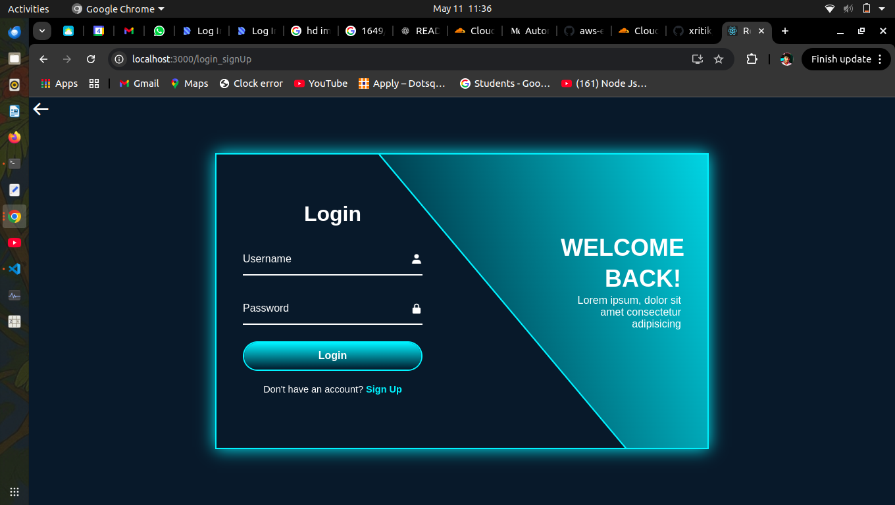
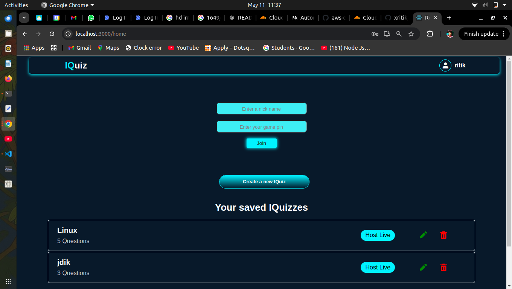
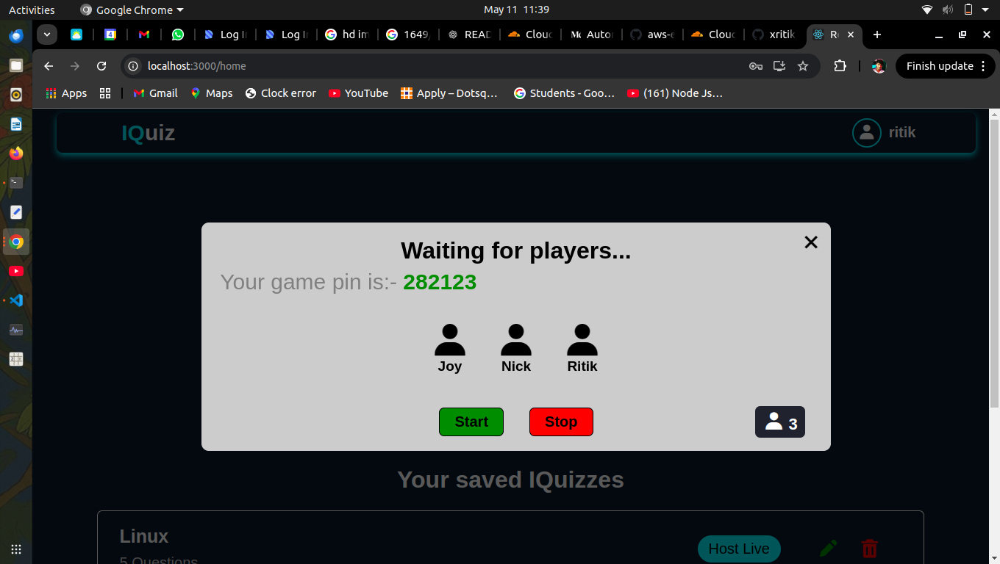
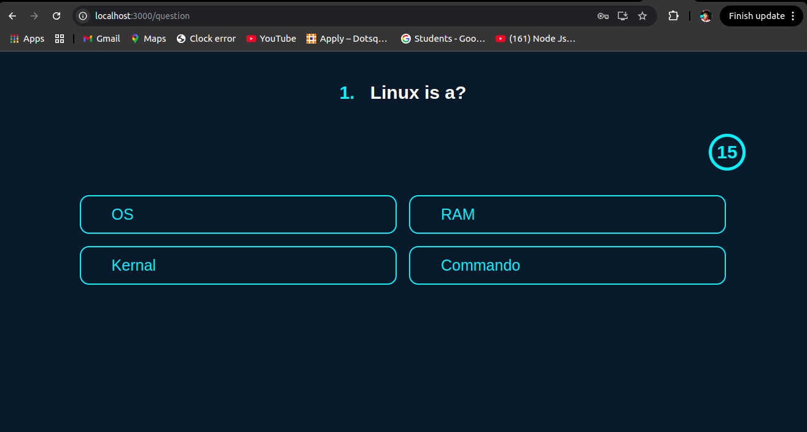
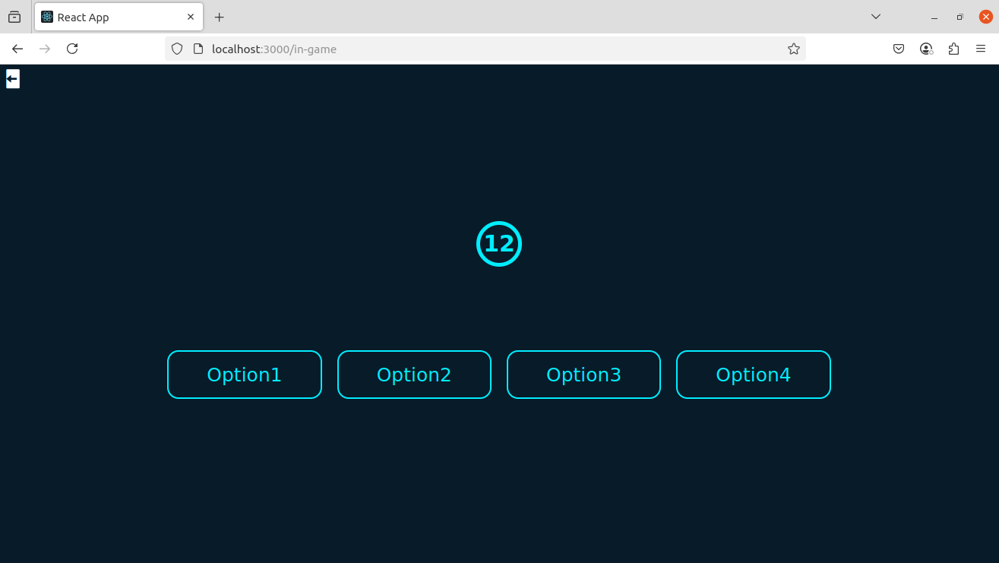
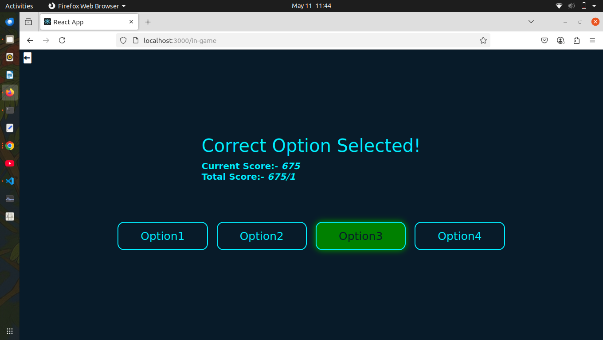
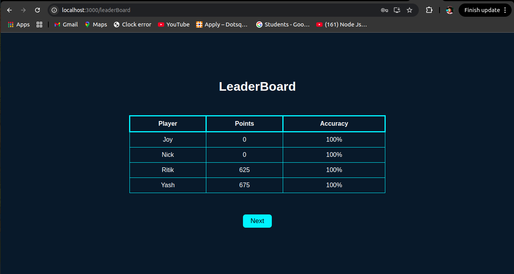

# 🧠 IQuiz – MERN Stack Live Quiz App

A full-stack real-time quiz application inspired by Kahoot!, built using the MERN stack (MongoDB, Express.js, React.js, Node.js). Users can create, edit, and delete quizzes, then host them live using a PIN that other players can use to join.
<br>
<br>

## 🚀 Features

- ✅ User Registration & Login (with validation)
- ✅ Create, Edit & Delete Custom Quizzes
- ✅ Real-Time Multiplayer Quiz Hosting
- ✅ Auto-generated Quiz PIN for Players
- ✅ Player Join via PIN
- ✅ Live Question Broadcasting and Answer Submission
- ✅ MongoDB for Persistent Storage
- ✅ Clean and Responsive UI
<br>
<br>

## 📸 Screenshots
<br>

- **Login Page**

<br>

- **Home Page**

<br>

- **Joining Players Section**

<br>

- **Showing IQuiz Q. Page**

<br>

- **Showing Options to Player Page**

<br>

- **Instant Performance to Player**

<br>

- **Leader Board Page**


## 📂 Folder Structure

iquiz_app/                                             <br>
│                                                      <br>
├── frontend/       # React frontend                   <br>
│ ├── public/                                          <br>
│ └── src/                                             <br>
│   ├── components/                                    <br>
│   ├── css/                                           <br>
│   ├── imgs/                                          <br>
│   ├── App.js                                         <br>
│   └── index.css                                      <br>
│   └── index.js                                       <br>
│ └── package.json  # Frontend metadata and scripts    <br>
│                                                      <br>
├── backend/        # Express backend                  <br>
│ ├── models/       # Mongoose schemas                 <br>
│ ├── routes/       # API endpoints                    <br>
│ ├── db.js         # Database connection              <br>
│ ├── package.json  # Backend metadata and scripts     <br>
│ └── server.js     # Entry point                      <br>
│                                                      <br>
├── .gitignore                                         <br>
├── package.json    # Project metadata and scripts     <br>
└── README.md       # You're reading it!               <br>
<br>
<br>

## 🧪 Tech Stack

**Frontend:**

- React.js
- HTML/CSS

**Backend:**

- Node.js
- Express.js
- MongoDB with Mongoose

<br>
<br>

## 🧱 Required Tech Stack & their Versions

<table width="500px">
  <thead>
    <th>Technology</th>
    <th>Version</th>
  </thead>
  <tbody>
    <tr>
      <td>Node.js</td>
      <td>20.19.0</td>
    </tr>
    <tr>
      <td>MongoDB</td>
      <td>8.0.1</td>
    </tr>
  </tbody>
</table>

<br>
<br>

## 🔧 Getting Started

**1. Clone the Repository**

```bash
git clone https://github.com/xritik/iquiz_app.git
cd iquiz_app
```
<br>
<br>

**2. Install Dependencies**

- **At Project Root:**

```bash
npm install
```

- **Frontend:**

```bash
cd ../frontend
npm install
```

- **Backend:**

```bash
cd backend
npm install
```
<br>
<br>

**3. Run the Application**
```bash
cd ../
npm start
```
<br>
<br>

## 🌐 Usage:

- Register or login with an existing account.
- Create a new quiz by adding questions and options.
- Host the quiz — you'll receive a PIN.
- Share the PIN with others so they can join.
- Control the flow of the quiz as the host while players answer questions in real-time.
<br>
<br>

## 👨‍💻 Author
Developed with ❤️ by [Ritik](https://github.com/xritik).