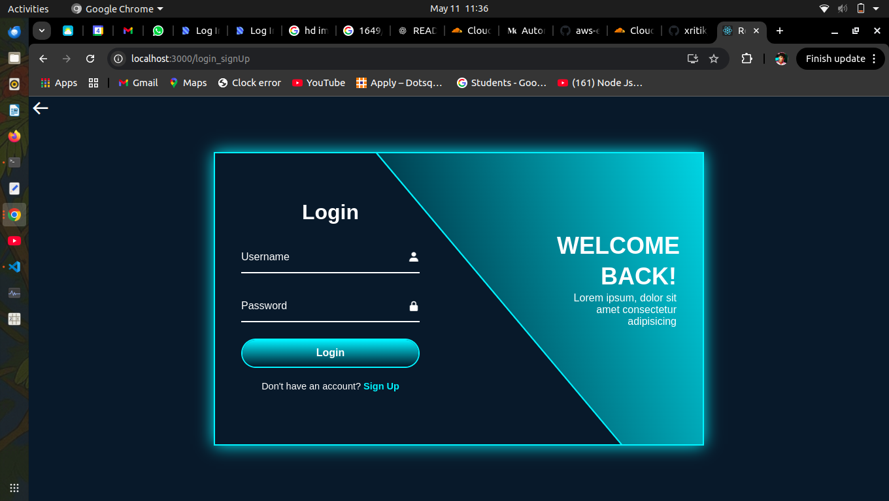
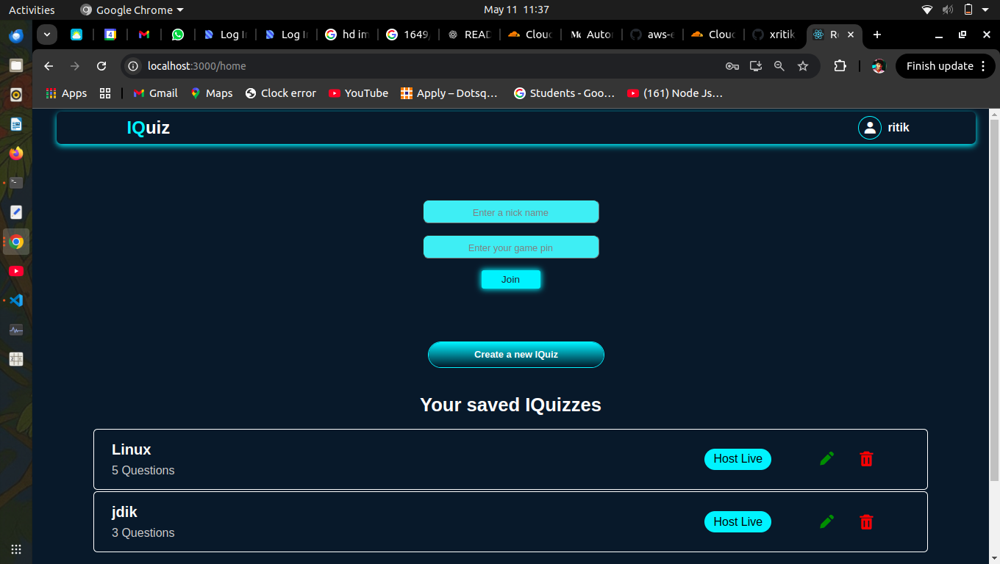
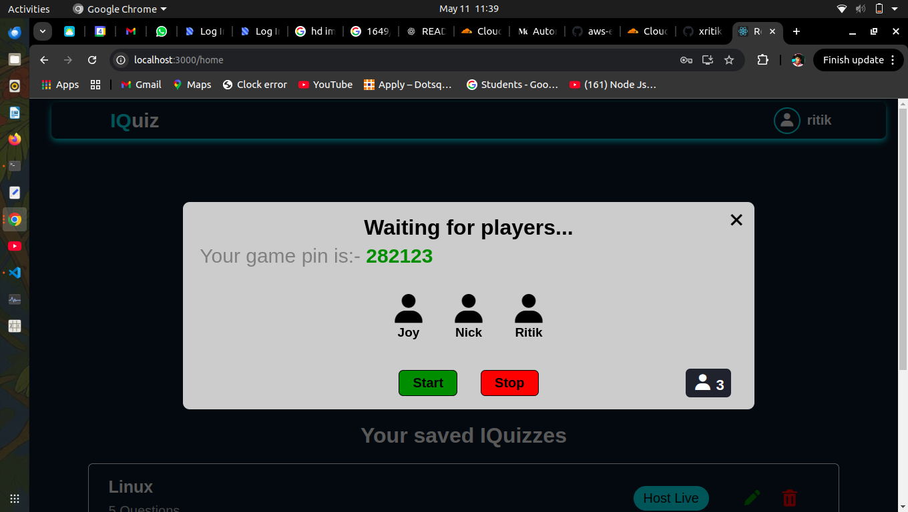
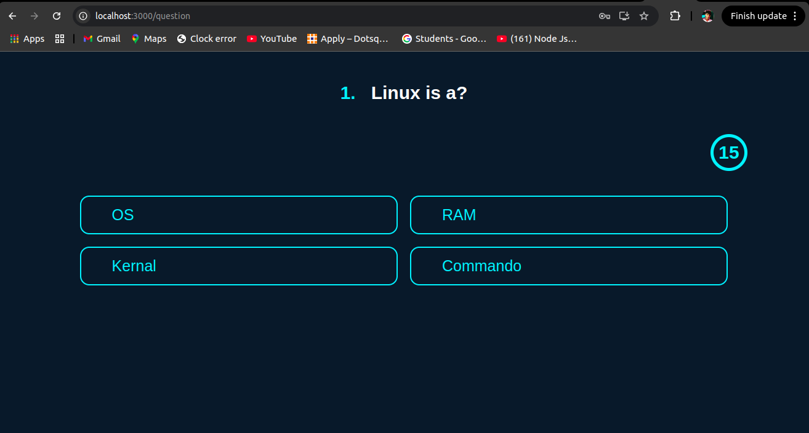
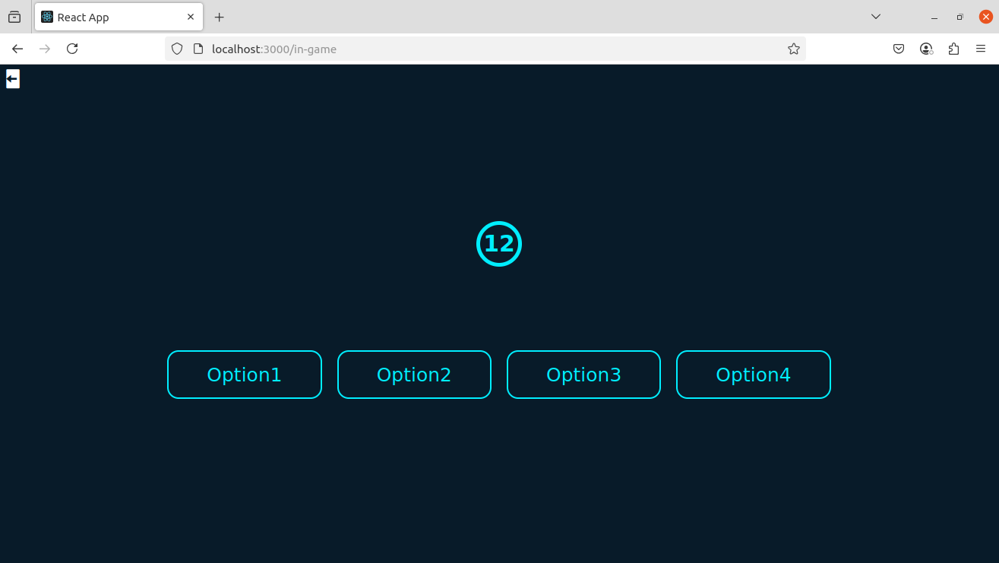
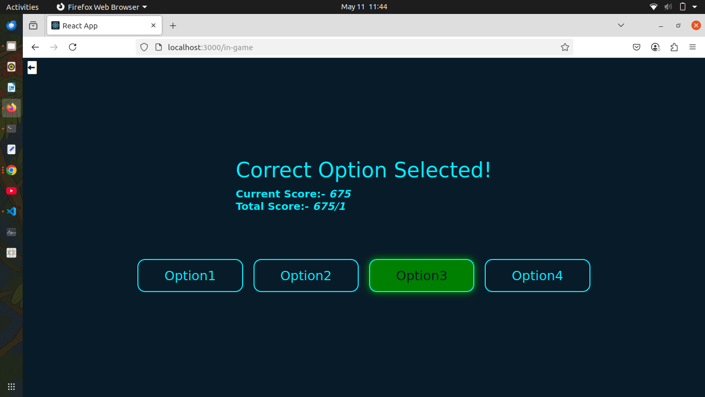
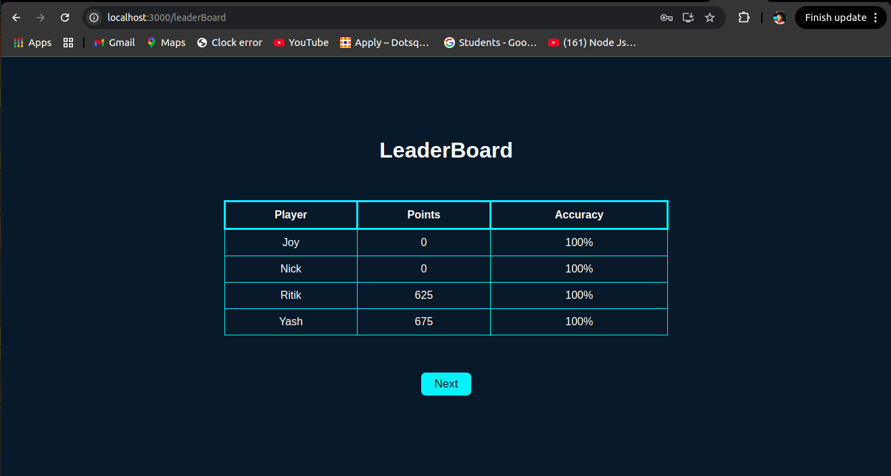

# 🧠 IQuiz – MERN Stack Live Quiz App

A full-stack real-time quiz application inspired by Kahoot!, built using the MERN stack (MongoDB, Express.js, React.js, Node.js). Users can create, edit, and delete quizzes, then host them live using a PIN that other players can use to join — with instant real-time communication powered by Socket.io WebSockets.
<br>

## 🔴 Now RiChat App is Live [here](https://iquiz7.vercel.app).
<br>

## 🚀 Features

- ✅ User Registration & Login (with validation)
- ✅ Create, Edit & Delete Custom Quizzes
- ✅ Real-Time Multiplayer Quiz Hosting via WebSockets (Socket.io)
- ✅ Auto-generated Quiz PIN for Players
- ✅ Player Join via PIN
- ✅ Live Question Broadcasting and Answer Submission
- ✅ Time-based Scoring (faster answers = more points)
- ✅ Live Leaderboard sorted by score after each question
- ✅ Correct/Incorrect answer highlighting after timer ends
- ✅ MongoDB Atlas for cloud persistent storage
- ✅ Deployed on Vercel (frontend) + Render (backend)
- ✅ Clean and Responsive UI
<br>
<br>

## 📸 Screenshots
<br>

- **Login Page**

<br>

- **Home Page**

<br>

- **Joining Players Section**

<br>

- **Showing IQuiz Q. Page**

<br>

- **Showing Options to Player Page**

<br>

- **Instant Performance to Player**

<br>

- **Leader Board Page**


## 📂 Folder Structure

iquiz_app/                                             <br>
│                                                      <br>
├── frontend/       # React frontend                   <br>
│ ├── public/                                          <br>
│ └── src/                                             <br>
│   ├── components/                                    <br>
│   ├── css/                                           <br>
│   ├── imgs/                                          <br>
│   ├── App.js                                         <br>
│   ├── socket.js   # Shared Socket.io client          <br>
│   └── index.css                                      <br>
│   └── index.js                                       <br>
│ └── package.json  # Frontend metadata and scripts    <br>
│                                                      <br>
├── backend/        # Express backend                  <br>
│ ├── models/       # Mongoose schemas                 <br>
│ ├── routes/       # API endpoints                    <br>
│ ├── db.js         # Database connection              <br>
│ ├── package.json  # Backend metadata and scripts     <br>
│ └── server.js     # Entry point                      <br>
│                                                      <br>
├── .gitignore                                         <br>
├── package.json    # Project metadata and scripts     <br>
└── README.md       # You're reading it!               <br>
<br>
<br>

## 🧪 Tech Stack

**Frontend:**

- React.js
- Socket.io-client
- HTML/CSS

**Backend:**

- Node.js & Express.js
- Socket.io
- MongoDB with Mongoose

<br>
<br>

## 🧱 Required Tech Stack & their Versions

<table width="500px">
  <thead>
    <th>Technology</th>
    <th>Version</th>
  </thead>
  <tbody>
    <tr>
      <td>Node.js</td>
      <td>20.19.0</td>
    </tr>
    <tr>
      <td>MongoDB</td>
      <td>8.0.1</td>
    </tr>
  </tbody>
</table>

<br>
<br>

## 🔧 Getting Started

**1. Clone the Repository**

```bash
git clone https://github.com/xritik/iquiz_app.git
cd iquiz_app
```
<br>
<br>

**2. Install Dependencies**

- **At Project Root:**

```bash
npm install
```

- **Backend:**

```bash
cd backend
npm install
```

- **Frontend:**

```bash
cd ../frontend
npm install
```

<br>
<br>

**3. Environment Variables**

Backend — backend/.env
```bash
MONGO_URI=mongodb+srv://<username>:<password>@cluster0.xxxxx.mongodb.net/mydb?retryWrites=true&w=majority
PORT=5000
```

Frontend — frontend/.env
```bash
REACT_APP_API_URL=https://backend-api-url.com
REACT_APP_WS_URL=wss://backend-api-url.com
```

**4. Run the Application**
```bash
cd ../
npm start
```
The app is [live here](https://iquiz7.vercel.app).
<br>
<br>

## 🌐 Usage:

- Open https://iquiz7.vercel.app in your browser.
- Register or login with an existing account.
- Create a new quiz by adding questions, options and timers.
- Click Host Live on any saved quiz — you'll receive a 6-digit PIN.
- Share the PIN with players so they can join from the home page.
- Once all players have joined, click Start.
- Questions are shown to the host; players see answer options in real-time.
- After each question timer ends, correct answers are revealed and scores update.
- The leaderboard is shown after each question; click Next to continue.
- After the final question, click Home to end the session.
<br>
<br>